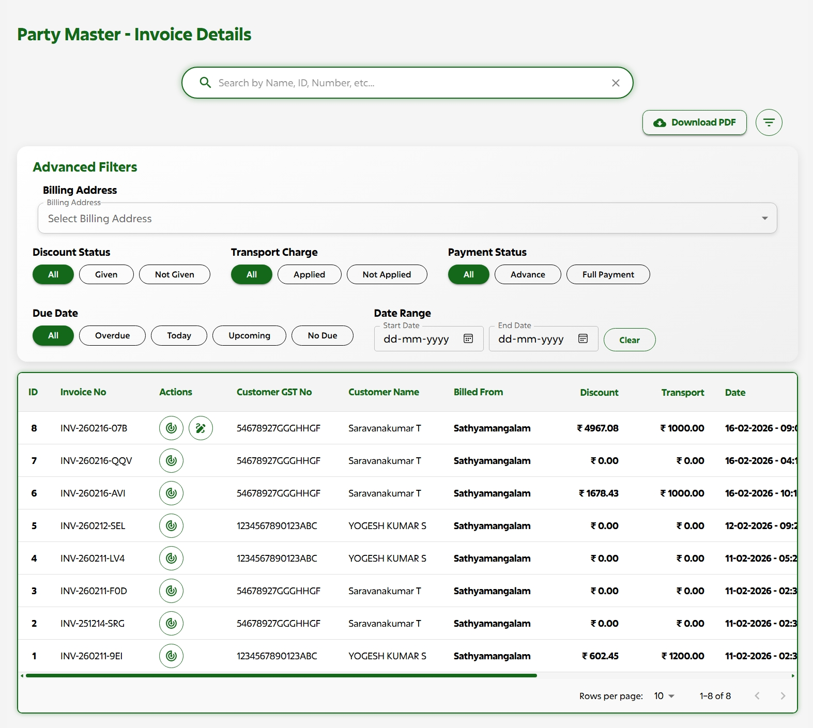
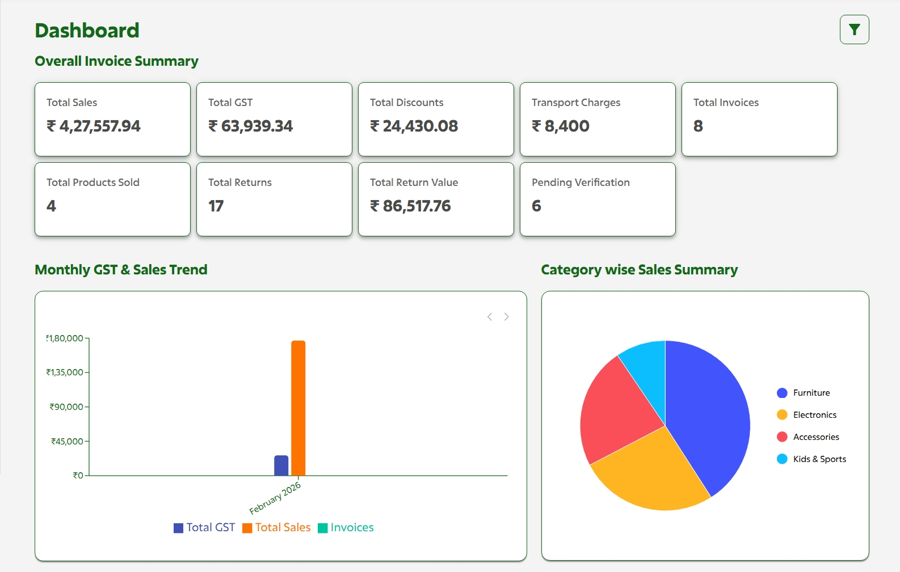
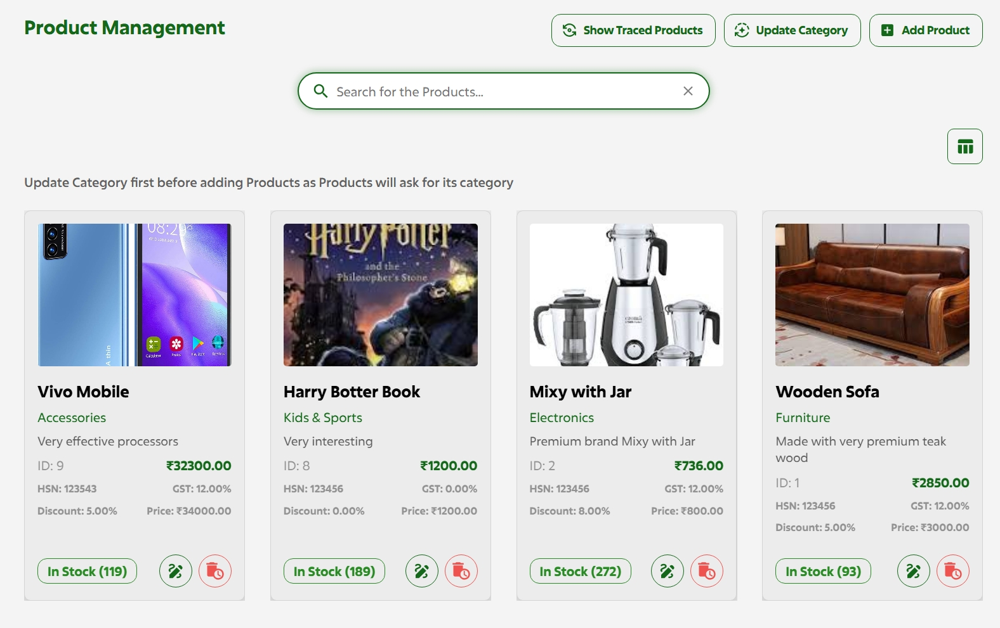
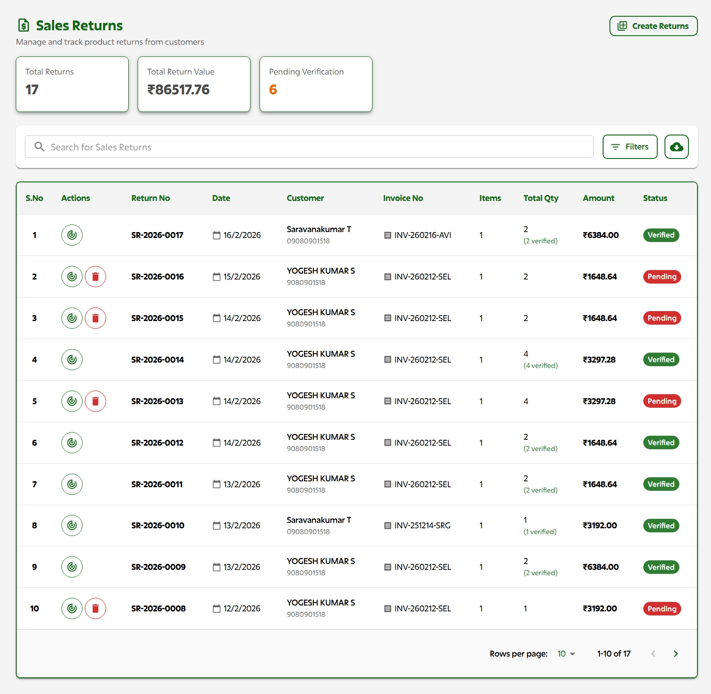
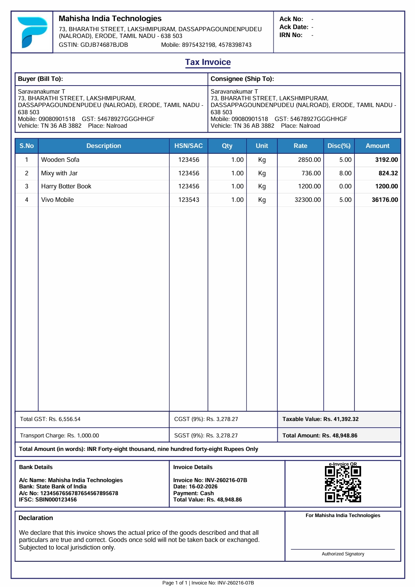
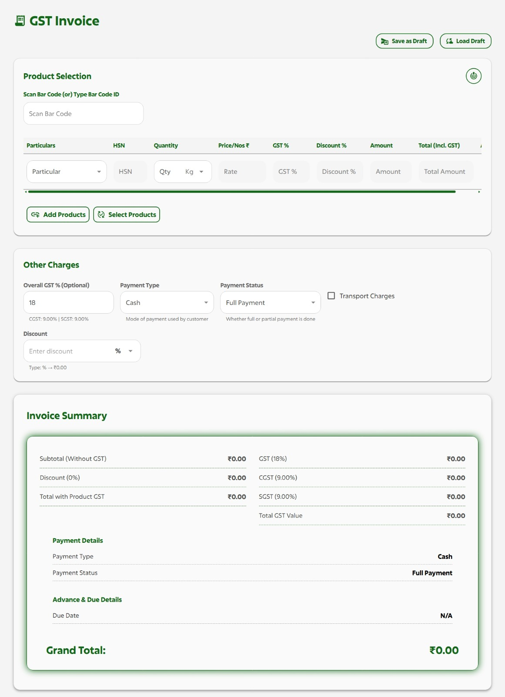
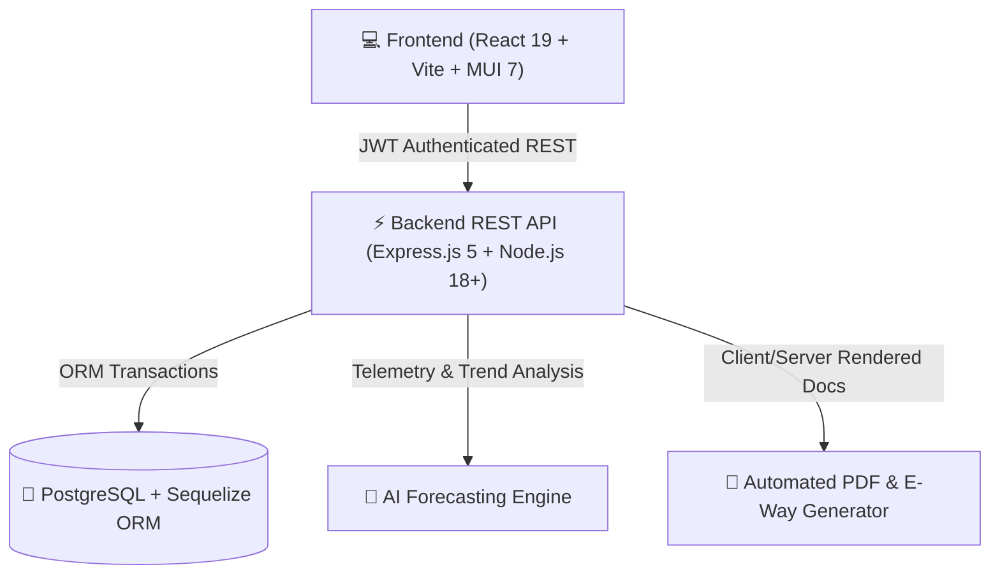

#  Visionize ERP — Modular GST & Smart Inventory Management System

[](https://opensource.org/licenses/MIT)
[](https://nodejs.org/)
[](https://reactjs.org/)
[](https://www.postgresql.org/)
[](#)

> **Open Hack 2026 Submission**  
> A high-performance, multi-tenant enterprise ERP platform engineered for modular GST billing, dynamic barcode POS scanning, real-time inventory tracking, AI-powered sales forecasting, and comprehensive fiscal analytics.

---

<div align="center">

| **1. Real-Time Financial Dashboard** | **2. GST POS Billing & Invoicing Engine** |
| :---: | :---: |
|  |  |

| **3. Party Master & Customer Directory** | **4. Product Inventory & Stock Movements** |
| :---: | :---: |
|  |  |

| **5. Sales Returns & Credit Note Auditing** | **6. Advanced Analytics & AI Insights** |
| :---: | :---: |
|  |  |

</div>

---

## 📑 Table of Contents
1. [Architecture Overview](#-architecture-overview)
2. [Core Modules & Features](#-core-modules--features)
3. [Open Source Software & Dependency Licenses](#-open-source-software--dependency-licenses)
4. [Prerequisites & System Requirements](#-prerequisites--system-requirements)
5. [Step-by-Step Local Setup & Execution Guide](#-step-by-step-local-setup--execution-guide)
6. [Environment Variables Configuration](#-environment-variables-configuration)
7. [Default Roles & Testing Credentials](#-default-roles--testing-credentials)
8. [Team Visionize Contributors](#-team-visionize-contributors)
9. [License](#-license)

---

## 🏗️ Architecture Overview



The system is decoupled into a lightweight **Vite-powered React single-page application** and an **Express/Sequelize microservice architecture**, featuring multi-tenant database partitioning, role-based route guards, and zero external runtime locks.

---

## 📦 Core Modules & Features

### 1. 🏷️ Product Catalogue & Stock Inventory
- **Product Hierarchy:** Categorization, HSN/SAC codes, tax rates (0%, 5%, 12%, 18%, 28%), and cost-to-retail margins.
- **Bulk Upload Support:** Native Excel/CSV mass product importer with client-side schema validation.
- **Stock Movement Ledger:** Automated audit logging of stock entries, batch deductions, and low-inventory threshold triggers.

### 2. 🧾 GST Invoicing & POS Billing Engine
- **Hardware Integration:** Real-time camera & USB Barcode Scanner (`html5-qrcode` & `react-barcode`).
- **Flexible Billing:** Switch between GST Tax Invoice, Cash POS Memo, and Proforma Invoices on the fly.
- **Automated Document Generation:** Instant client-side & server-side generation of GST Tax Invoices, Delivery Challans, and E-Way Bills (`jspdf`, `jspdf-autotable`, `pdfkit`).
- **Omnichannel Dispatch:** Direct customer delivery via Email (SMTP/ZeptoMail) and WhatsApp integrations.

### 3. 👥 Party Master & Customer Directory
- **Comprehensive Ledger:** Unified credit/debit transaction records, GSTIN lookup, and advance payment tracking.
- **Live Preview Modals:** Interactive invoice previews and payment status reconciliation.

### 4. 📊 GST Analytics & Financial Dashboard
- **Visual Analytics:** Interactive monthly sales trends, category distribution pie charts, and customer spending graphs (`recharts`, `@mui/x-charts`).
- **Automated Tax Summaries:** Instant calculation of CGST, SGST, IGST liability and 1-click tax report PDF export.

### 5. 🤖 AI Insights & Smart Inventory Forecasting
- **Predictive Demand:** Sales velocity analytics predicting stock depletion and suggesting restocking dates.
- **KPI & ROI Tracking:** Snapshot analytics tracking feature utilization, transaction volume, and operational cost savings.

### 6. 🔐 Multi-Tenant Auth & Role-Based Access Control (RBAC)
- **Granular Roles:** Dedicated workflows for `super_admin`, `admin`, `cashier`, and `sales`.
- **SuperAdmin Portal:** Company tenant onboarding, subscription license control (`bill`, `invoice`, `both`), and organization provisioning.

### 7. 🔄 Returns Management & Stock Auditing
- **Sales Returns & Credit Notes:** Direct linking of original invoice numbers to reverse items into active inventory.
- **Return Stock Verification:** Inspection workflow for damaged, defected, or restocked merchandise.

---

## 📚 Open Source Software & Dependency Licenses

This project is built using open-source libraries under permissive licenses (MIT, Apache-2.0, BSD):

### Frontend Dependencies

| Package Name | Version | License | Purpose |
| :--- | :--- | :--- | :--- |
| **`react`** / **`react-dom`** | `^19.0.0` | MIT | Core UI component engine |
| **`vite`** | `^6.2.0` | MIT | Fast frontend build tool and dev server |
| **`@mui/material`** | `^7.2.0` | MIT | Material Design component library |
| **`@mui/icons-material`** | `^7.0.1` | MIT | Material UI icon set |
| **`@mui/x-charts`** | `^8.5.0` | MIT | Responsive dashboard charts & analytics |
| **`@mui/x-data-grid`** | `^7.28.3` | MIT | High-performance enterprise data tables |
| **`recharts`** | `^2.15.3` | MIT | Declarative charting library for React |
| **`framer-motion`** | `^12.23.22` | MIT | Smooth UI animations and modal transitions |
| **`axios`** | `^1.8.4` | MIT | Promise-based HTTP client |
| **`react-router-dom`** | `^7.5.0` | MIT | Declarative routing and route guarding |
| **`jspdf`** / **`jspdf-autotable`** | `^4.1.0` / `^5.0.2` | MIT | Client-side PDF invoice & report generation |
| **`html5-qrcode`** | `^2.3.8` | Apache-2.0 | Camera & hardware barcode scanner |
| **`exceljs`** / **`read-excel-file`** | `^4.4.0` / `^6.0.3` | MIT | Excel mass product upload & parsing |
| **`dayjs`** / **`date-fns`** | `^1.11.18` / `^4.1.0` | MIT | Date calculations & fiscal period parsing |

### Backend Dependencies

| Package Name | Version | License | Purpose |
| :--- | :--- | :--- | :--- |
| **`express`** | `^5.1.0` | MIT | REST API web framework |
| **`sequelize`** | `^6.37.8` | MIT | Promise-based ORM for PostgreSQL |
| **`pg`** / **`pg-hstore`** | `^8.20.0` / `^2.3.4` | MIT | PostgreSQL client and serializer |
| **`jsonwebtoken`** | `^9.0.2` | MIT | JWT token generation & verification |
| **`bcrypt`** / **`bcryptjs`** | `^6.0.0` / `^3.0.2` | MIT / BSD-3-Clause | Secure password hashing |
| **`cors`** | `^2.8.5` | MIT | Cross-Origin Resource Sharing middleware |
| **`dotenv`** | `^16.6.1` | BSD-2-Clause | Environment variable management |
| **`multer`** | `^1.4.5-lts.2` | MIT | File & image upload handling |
| **`pdfkit`** | `^0.17.1` | MIT | Server-side PDF generation |
| **`qrcode`** | `^1.5.4` | MIT | QR Code generation for UPI/GST invoices |
| **`nodemailer`** | `^9.0.1` | MIT | Email dispatch service |
| **`nodemon`** | `^3.1.10` | MIT | Development server hot-reloader |

---

## ⚙️ Prerequisites & System Requirements

Ensure the following tools are installed on your machine:
- **Node.js:** `v18.0.0` or higher ([Download](https://nodejs.org/))
- **npm:** `v9.0.0` or higher
- **PostgreSQL:** `v14.0` or higher ([Download](https://www.postgresql.org/))
- **Git:** `v2.30.0` or higher

---

## 🚀 Step-by-Step Local Setup & Execution Guide

### 1. Clone the Repository
```bash
git clone https://github.com/Yogeshkumar200516/Open_Hack_2026_Visionize.git
cd Open_Hack_2026_Visionize
```

---

### 2. Database Initialization
1. Start your PostgreSQL service.
2. Create a database named `erp_software`:
```sql
CREATE DATABASE erp_software;
```
3. Run the schema migrations or import the initial schema (`Backend/orm_db.sql`).

---

### 3. Backend Setup & Startup
1. Navigate to the backend directory:
```bash
cd Backend
```
2. Install dependencies:
```bash
npm install
```
3. Configure your `.env` file (see [Environment Variables](#-environment-variables-configuration)).
4. Start the backend development server:
```bash
npm run dev
```
> Server runs on `http://localhost:5000` with API health check at `http://localhost:5000/`

---

### 4. Frontend Setup & Startup
1. Open a new terminal and navigate to the frontend directory:
```bash
cd Frontend
```
2. Install dependencies:
```bash
npm install
```
3. Start the Vite React development server:
```bash
npm run dev
```
> Frontend runs on `http://localhost:5173`

---

## 🔑 Environment Variables Configuration

### Backend `.env` (`Backend/.env`)
```env
PORT=5000
NODE_ENV=development

# Database Configuration
DB_HOST=localhost
DB_PORT=5432
DB_NAME=erp_software
DB_USER=postgres
DB_PASSWORD=your_postgres_password

# Authentication
JWT_SECRET=your_super_secret_jwt_key_2026

# Email Dispatcher (Optional SMTP)
SMTP_HOST=smtp.gmail.com
SMTP_PORT=587
SMTP_USER=your_email@gmail.com
SMTP_PASS=your_app_password
```

### Frontend `.env` (`Frontend/.env`)
```env
VITE_API_BASE_URL=http://localhost:5000
```

---

## 👤 Default Roles & Testing Credentials

| Role | Access Level | Permitted Pages |
| :--- | :--- | :--- |
| **`super_admin`** | Platform Super Administrator | Company Onboarding, Tenant Configuration, Admin Provisioning |
| **`admin`** | Company Tenant Administrator | Dashboard Analytics, Products, GST Invoicing, Party Master, Returns, AI Insights, User Billing |
| **`cashier`** | Point of Sale & Billing Operator | GST Invoicing, POS Billing, Party Master, Sales Returns, AI Insights |
| **`sales`** | Sales Representative | Product Catalogue, Stock Views, GST Billing & Quotation Generation |

---

## 👥 Team Visionize Contributors

| Name | Role | Primary Contributions | GitHub Profile |
| :--- | :--- | :--- | :--- |
| **Yogeshkumar** | **Lead & Backend Integration** | Backend Architecture, Express REST APIs, PR Merging & Release | [@Yogeshkumar200516](https://github.com/Yogeshkumar200516) |
| **Nithyanandam N** | **Products & GST Invoicing** | Product Inventory, Stock Movement, Party Master, GST Invoicing Engine & PDF Export | [@nnithyanandam024](https://github.com/nnithyanandam024) |
| **Abarna T** | **Dashboards & AI Insights** | Real-time GST Analytics, Charts, AI Sales Forecasting & KPI Tracking | [@abarna-t](https://github.com/abarna.thiyagarajan23) |
| **Abinaya L** | **Auth, Users & Returns** | Multi-tenant RBAC, SuperAdmin Portal, Sales Returns & Return Stock Auditing | [@abinayal-cs24](https://github.com/abinayal) |

---

## 📄 License
This project is open-source software licensed under the [MIT License](LICENSE).  
Copyright (c) 2026 **Team Visionize**.
